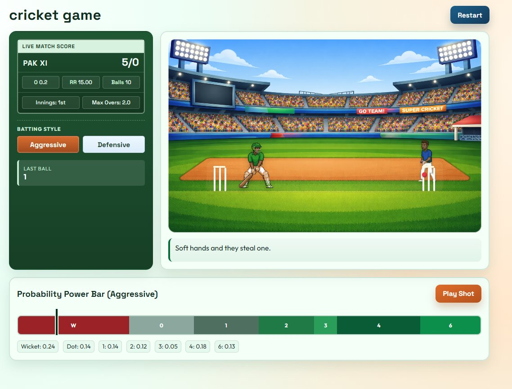
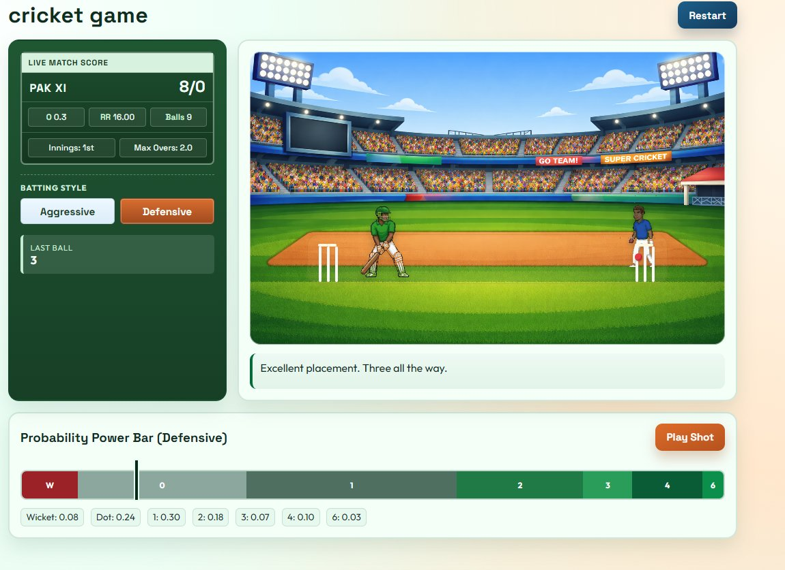
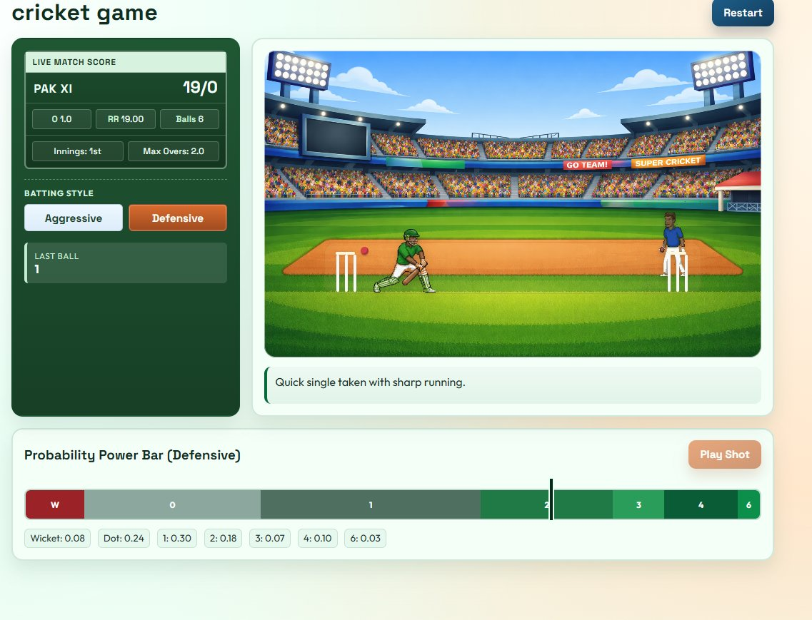
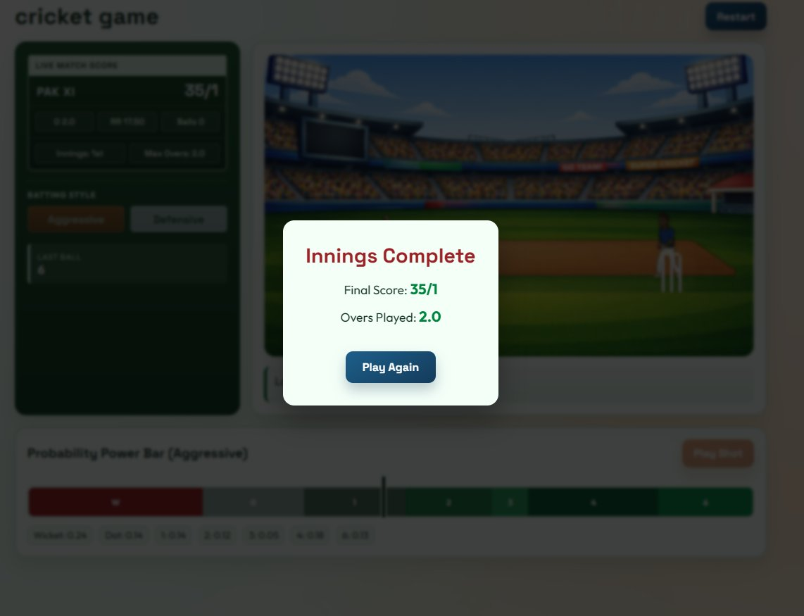

<div align="center">

# 🏏 Super Cricket

**A browser-based 2D cricket game with real-time probability mechanics, sprite animations, and dynamic commentary.**



[](https://your-demo-link.com)
[](https://developer.mozilla.org/en-US/docs/Web/JavaScript)
[](https://developer.mozilla.org/en-US/docs/Web/HTML)
[](https://developer.mozilla.org/en-US/docs/Web/CSS)

</div>

---

## 🎮 What Is This?

Super Cricket is a fully playable 2D cricket game that runs in the browser — no installs, no frameworks, no dependencies. The player faces a live bowler, selects a batting style, and times a shot using an animated power bar. Every ball outcome is determined by a real-time probability engine, not a random number generator.

The project demonstrates **game logic design**, **sprite animation synchronisation**, **deterministic probability mapping**, and **clean UI/UX** — all in vanilla JS.

---

## ✨ Features

- 🎯 **Skill-based timing** — a moving slider over a segmented probability bar means every outcome depends on when you click
- 🏏 **Two batting styles** — Aggressive (high-risk, high-reward) vs Defensive (consistent, lower ceiling)
- 🎬 **Layered sprite animations** — bowler delivery, ball-in-flight arc, and batsman shot/dismissal all sync frame-perfectly
- 📊 **Live scoreboard** — run rate, balls remaining, over counter, and last-ball result update in real time
- 💬 **Dynamic commentary** — contextual text reacts to each outcome
- 🔄 **Innings complete screen** — final score summary with instant replay option

---

## 📸 Screenshots

### Aggressive Batting — Power Bar in Action
> Higher boundary probability, higher wicket risk. The bar is wider in the red and green zones.


---

### Defensive Batting — Safe Scoring Profile
> Wicket probability drops to 8%. The bar is dominated by the 1-run segment — perfect for rotating strike.



---

### Mid-Delivery — Ball in Flight
> The ball travels frame-by-frame from the bowler hand to the bat. Outcome resolves only at contact.



---

### Innings Complete Screen
> Final score modal with total runs, wickets, and overs played.



---

## 🧠 How the Probability Engine Works

The power bar is divided into **7 segments**, each sized proportionally to its outcome weight:

| Outcome | Aggressive | Defensive |
|---------|-----------|-----------|
| Wicket  | 0.24      | 0.08      |
| Dot (0) | 0.14      | 0.24      |
| 1 run   | 0.14      | 0.30      |
| 2 runs  | 0.12      | 0.18      |
| 3 runs  | 0.05      | 0.07      |
| 4 runs  | 0.18      | 0.10      |
| 6 runs  | 0.13      | 0.03      |

When the player clicks **Play Shot**, the slider's current position `s ∈ [0, 1]` is frozen. The engine scans cumulative ranges left-to-right and returns the first outcome where `s ≤ cumulative`. This means the result is **fully deterministic at click time** — the player can learn the bar and improve their timing.

```js
function resolveOutcome(sliderValue, probabilities) {
  let cumulative = 0;
  for (const [outcome, prob] of Object.entries(probabilities)) {
    cumulative += prob;
    if (sliderValue <= cumulative) return outcome;
  }
}
```

---

## 🎬 Animation Architecture

Three independent layers are synchronised per delivery:

```
[Bowler sprite]  →  release frame offset  →  [Ball in flight]
                                                      ↓
                                          contact point reached
                                                      ↓
                                          [Outcome resolves]
                                                      ↓
                                          [Batsman sprite row switches]
                                          [Commentary + scoreboard update]
```

- **Bowler** — switches from idle → bowl row on delivery start
- **Ball** — released at a configurable frame offset; follows a straight delivery path, then an arc keyframe path post-contact (parabolic for 4/6, low curve for singles, deflection curve for wickets)
- **Batsman** — outcome maps to a sprite row (`out`, `six`, `four`, `defensive`); dismissal animation runs to final-frame hold before scene reset
- **Stumps** — transition to broken-stump sprite on wicket, timed to ball contact frame

---

## 🚀 Getting Started

```bash
git clone https://github.com/your-username/super-cricket.git
cd super-cricket
# Open index.html in any modern browser — no build step required
open index.html
```

> No Node.js, no npm, no bundler. Pure HTML + CSS + JS.

---

## 🗂 Project Structure

```
super-cricket/
├── index.html              # Entry point
├── style.css               # Game UI styling
├── game.js                 # Core game loop & outcome engine
├── animations.js           # Sprite + ball animation controller
├── commentary.js           # Commentary text mapping
├── assets/
│   ├── sprites/            # Bowler, batsman, stumps sprite sheets
│   ├── backgrounds/        # Stadium background layers
│   └── sounds/             # (optional) crowd and bat sounds
└── screenshots/            # README preview images
```

---

## 🛠 Tech Stack

| Layer | Technology |
|-------|-----------|
| Rendering | HTML5 Canvas / DOM sprites |
| Game Logic | Vanilla JavaScript (ES6+) |
| Animations | CSS keyframes + JS frame stepping |
| Styling | CSS3 with custom properties |
| Build | None — zero dependencies |

---

## 💡 Key Engineering Decisions

**Why deterministic probability instead of `Math.random()`?**
Random outcomes remove player agency. A deterministic slider map means outcomes are reproducible and learnable — closer to real game feel where timing and decision-making matter.

**Why vanilla JS instead of a game engine?**
Keeping the project dependency-free makes it instantly runnable, easy to audit, and a better demonstration of low-level game loop and animation concepts.

**Why synchronise animations to outcome resolution?**
Resolving the outcome at visual contact timing (rather than on click) prevents score updates from appearing before the shot animation — a subtle detail that makes the game feel polished.

---

## 📄 License

MIT — free to use, fork, and build on.

---

<div align="center">

Made with ☕ and a love for cricket

</div>
